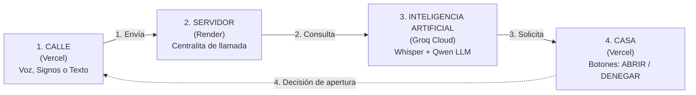

# FERMAX · F.O.N.A. (Fermax Operative Natural Assistant)
## Videoportero Accesible con Inteligencia Artificial Multimodal

Prototipo funcional de videoportero inteligente y accesible universal desarrollado bajo la identidad corporativa de **FERMAX** (`#004F9F`). Elimina las barreras de comunicación tradicionales en el acceso a viviendas para personas sordas, con discapacidad auditiva, del habla o motora.

El sistema opera de manera autónoma las 24 horas del día en la nube de forma **100% gratuita**, sin requerir servidores locales ni hardware GPU dedicado.

---

## 🌟 Características Principales

- **Interacción Multimodal Universal**: Permite al visitante comunicarse mediante **Voz**, **Lengua de Signos** (visión por computador) o **Texto Plano**.
- **Reconocimiento de Lengua de Signos en Cliente**: Integra MediaPipe Tasks Vision y un clasificador gestual k-NN (63/126 dimensiones) que procesa los signos a 30 FPS en el propio dispositivo del usuario sin enviar secuencias de vídeo privado por internet.
- **IA Conversacional en Español**: Inferencia ultrarrápida (~0.2s) con Groq Cloud API ejecutando los modelos `whisper-large-v3-turbo` (transcripción de voz) y `qwen/qwen3.6-27b` (asistente conversacional con *Tool Calling*).
- **Autorización Remota en la Vivienda**: El residente recibe la solicitud en su monitor y autoriza (**Abrir**) o deniega (**Denegar**) el acceso con un solo clic.

---

## 📐 Arquitectura y Flujo del Sistema



---

## 🚀 Despliegue en Producción

- 🌐 **Frontend (Vercel CDN)**: [https://fona-portero.vercel.app](https://fona-portero.vercel.app)
  - Portal Principal: `/`
  - Placa Exterior (Calle): `/calle/`
  - Monitor Vivienda (Casa): `/casa/`
- ⚙️ **Backend (Render Web Services)**: [https://fona-1ir2.onrender.com](https://fona-1ir2.onrender.com)
  - Estado del servidor: `GET /health`
  - Peticiones pendientes: `GET /pending`

---

## 🛠️ Tecnologías Empleadas

- **Frontend**: HTML5, CSS3 Fermax Blue (`#004F9F`), JavaScript ES6+ Modular, `@mediapipe/tasks-vision`, Web Audio API.
- **Backend**: Python 3.10+, FastAPI, Uvicorn, Pydantic, HTTPX.
- **IA Cloud**: Groq Cloud API (`whisper-large-v3-turbo` + `qwen/qwen3.6-27b`).

---

## 📄 Licencia y Créditos

Desarrollado para **FERMAX Electrónica, S.A.U.** · Proyecto FONA (2026).
curl -X POST http://localhost:8080/pending/<id>/approve
```

Esta separación es deliberada: un modelo de lenguaje que conversa con
desconocidos es vulnerable a instrucciones maliciosas habladas, y la decisión de
franquear el acceso a una vivienda no debe depender de él.

## Añadir acciones nuevas

En `tools.py`, decorar una función asíncrona:

```python
@tool(
    description="Qué hace y cuándo debe usarse",
    params={"arg": {"type": "string", "description": "..."}},
    required=["arg"],
)
async def mi_funcion(ctx: dict, arg: str) -> str:
    return "Resultado que verá el modelo"
```

El esquema JSON y el registro se generan solos. Con `ends_session=True` la
conversación termina tras ejecutarla.

## Latencia

| Etapa | GPU | CPU |
|---|---|---|
| Whisper, 4 s de audio | ~0,4 s (medium) | ~3 s (small) |
| LLM 7B, 40 tokens | ~0,7 s | ~6 s |
| Piper | ~0,2 s | ~0,4 s |
| **Total por turno** | **~1,3 s** | **~10 s** |